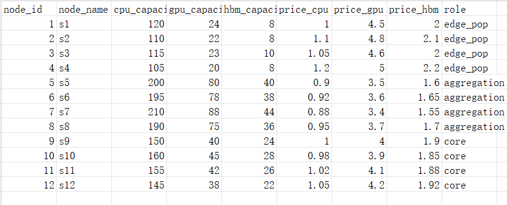

# Compute-aware Routing

> **论文初稿（推荐主阅读）**：完整符号表、双层规划合理性论述、Model A–D 逻辑链与联调流程、与 TEAVAR/Copo/AEGIS 的关系，见 **[`论文初稿.md`](./论文初稿.md)**。  
> 本文档保留 **Overview、数据集说明、实验结果表**；公式与代码逐条对应见 **[`建模公式说明.md`](./建模公式说明.md)**。

---

## Overview

在算力网中，联合优化：

- 任务放置 （task placement）
- 多路径分流 （multipath traffic splitting）
- 风险感知 （risk-aware optimization）

一个请求：

src node → compute node → des node

分成ingress stage 和egress stage两阶段路由

| 决策变量 | 含义 | |
| --- | --- | --- |
| $y_{i,m} \in \{0,1\}$ | 任务 $i$ 是否部署在算力节点 $m$ | |
| $x_{i,m,p}^{\mathrm{in}} \in [0, 1]$ | 任务 $i$ 被部署到节点 $m$ 后，ingress 流量有多少比例走路径 $p$ | |
| $x_{i,m,q}^{\mathrm{out}} \in [0, 1]$ | 任务 $i$ 被部署到节点 $m$ 后，egress 流量有多少比例走路径 $q$ | |
| 成本约束 | 含义 | |
| $i = [\mathrm{src}(i), \mathrm{dst}(i), b_i^{\mathrm{in}}, b_i^{\mathrm{out}}, w_{ik}]$ | 任务 $i$ 的给定信息 | |
| $b_i^{\mathrm{in}}$ | 任务 $i$ 在 ingress 流量 | |
| $b_i^{\mathrm{out}}$ | 任务 $i$ 在 egress 流量 | |
| $w_{i,k}$ | 任务 $i$ 对第 $k$ 类资源的需求，例如 CPU, GPU, HBM, … | |
| $p_{m,k}$ | 节点 $m$ 上第 $k$ 类资源单价 | |
| $P_p,\, P_q$ | 路径 $p$ / 路径 $q$ 的单位带宽成本 | |
| $\mathcal{P}_{i,m}^{\mathrm{in}}$ | 任务 $i$ 部署在算力节点 $m$ 后，从 $\mathrm{src}(i) \to m$ 的 ingress 路径集合 | |
| $\mathcal{Q}_{i,m}^{\mathrm{out}}$ | 任务 $i$ 部署在算力节点 $m$ 后，从 $m \to \mathrm{dst}(i)$ 的 egress 路径集合 | |

1. 部署成本：
   $$
   E_{\text{placement}} = \sum_{i\in \mathcal{J}}\sum_{m \in \mathcal{M}} y_{i,m}\Bigl(\sum_{k} w_{i,k}\, p_{m,k}\Bigr)
   $$

2. 带宽成本：
   $$
   E_{\text{bandwidth}} = \sum_{i \in \mathcal{J}}\sum_{m \in \mathcal{M}}\Bigl(\sum_{p \in \mathcal{P}_{i,m}^{\mathrm{in}}} x_{i,m,p}^{\mathrm{in}}\, b_i^{\mathrm{in}}\, P_p + \sum_{q \in \mathcal{Q}_{i,m}^{\mathrm{out}}} x_{i,m,q}^{\mathrm{out}}\, b_i^{\mathrm{out}}\, P_q\Bigr)
   $$
   

## Introduction

（动机、双层规划是否适用、四模型逻辑关系、主模型选型等已迁入 [`论文初稿.md`](./论文初稿.md) 第 1–7 节；此处仅列贡献要点。）

1. 基于真实 B4 拓扑构建算力+网络联合数据集，并与玩具网对比。  
2. 设计 **SLA 型 CVaR（主）** 与 **Physical 利用率 CVaR（对照）**。  
3. UMCF / 虚拟接入，缓解 hub 径向下 SLA CVaR 退化。  
4. 求解：**Model A/C 为精确主链**；Model B/D 为 KKT 验证与 Copo 式松弛消融。

---

## Motivation

（详见 [`论文初稿.md`](./论文初稿.md) §1–§2。）

1. 自建数据集过于简化。  
2. 租户更关心 **送达/满足率**（TEAVAR/AEGIS），利用率 CVaR 作资源侧对照。  
3. Copo 的 McCormick 可加速但存在 **风险穿透**——故不作主求解器，仅作 Model D 消融。

---

## Design

（建模分节、符号与公式推导见 [`论文初稿.md`](./论文初稿.md) §3–§6 与 [`建模公式说明.md`](./建模公式说明.md)。下为提纲性保留。）

### 1. 数据集调整

#### 1）`topology.txt`

  1）topology.txt

  容量约束：在保持B4原有拓扑与有向连通性的前提下，将链路的统一容量（$5\times 10^6$）替换为 $3.8\times 10^6 \sim 6.17\times 10^6$ 量级的不同容量。这种非均匀容量更真实，更能体现出模型的优化结果

  独立故障率配置：重构了prob_failure列，每条链路的不同端点有独立故障概率（约 $1.5\times 10^{-3}\sim 4.5\times 10^{-3}$）。
  2）算力资源池与分层语义 (node_compute_resources.csv)

  多维算力约束：为B4拓扑的12个节点注入了多维算力属性，明确定义CPU、GPU 和 HBM三类计算资源的容量上界与单位价格。

  层级架构约束 (role 字段)：根据物理位置引入了edge_pop（边缘节点）、aggregation（汇聚节点）与core（核心节点）的分层语义。在设计的极端场景（$s=2$）下，系统会主动收缩 aggregation 节点的可用算力上限，模拟区域性能源故障的冲击。

  3）需求矩阵与路由路径保持

  需求矩阵 (demand.txt) 与节点定义 (nodes.txt) 不变。

---

### 2. 建模设计

#### 2.1 单层优化

##### 1）加权 CVaR
  将成本与风险置于同一个优化层级内，通过直接的数学变换构建纯粹的混合整数线性规划 (MILP) 问题，不需要构造双层结构进行主从博弈

  设计逻辑：直接通过引入辅助变量与线性不等式来等价表述CVaR。

  优化目标：将成本与风险视为平行的优化维度，通过灵敏度权重$\lambda$构造联合目标函数：$\min \text{Cost} + \lambda \cdot \text{CVaR}$。

  模型优势：由于保持了原问题的纯凸性，该模型避免了由于近似或非线性放缩带来的计算误差。

##### 2）单层 KKT 加权
  设计逻辑：本模型将底层风险评估问题向单层约束转化。它首先写出风险评估子问题的KKT最优性条件，以此将求风险极小值的过程转化为一组等价的数学约束。

  核心机制：在处理KKT条件中非线性的互补松弛项时，本模型坚持绝对精确原则，引入0-1二元指示变量进行逻辑约束（即要求对偶变量或松弛变量中至少有一项严格为0）。重构后的精确约束群被整体并入上层，形成一个单层精确求解器。

#### 2.2 双层优化

##### 1）$\varepsilon$-约束
  设计逻辑：不同于加权模型在目标函数中的软性妥协，$\varepsilon$-约束模型将下层反馈的风险评估结果作为上层决策的硬性物理边界。

  核心机制：模型的优化目标退化为纯粹的 $\min \text{Cost}$，但强制要求下层计算出的风险值必须小于等于人为设定的安全阈值 $\Gamma$（即 $\text{Risk} \le \Gamma$）。

  应用价值：该模型可以很好的探测系统物理极限。通过收紧阈值 $\Gamma$，系统能清晰地找出算力网络在极端应力下发生不可解的边界，从而严格验证架构的适用性。

##### 2）Copo / McCormick

  设计逻辑：此模型旨在复现并验证部分Copo中的双层近似松弛算法。

  核心机制：同样基于双层KKT转化框架，但在面对下层复杂的非线性互补松弛条件时，本模型放弃了精确的二元指示变量，转而采用McCormick线性包络对乘积项进行连续性放缩近似。

  实验意义：虽然McCormick松弛大幅降低了求解复杂度，但本次实验通过该模型找出其在算力网络调度中的致命缺陷——风险穿透。即模型在松弛空间内给出的低成本调度方案，在真实物理映射下往往伴随着极高的崩溃风险，反向证明了前述精确约束模型设计的必要性。

### 3. 路径选择设计

#### 定点方向与 $K$ 短路

设计逻辑：系统强制规定一个物理中心节点（Node 0）作为所有外部任务流量的唯一入口。
路径构造：利用 Yen's Algorithm 在物理拓扑上预计算从 Hub 节点到各潜在计算节点 $m \in M$ 的 $K$ 条最短路径（$K$-Shortest Paths）。
局限性：与实际情况相比简化较多

#### UMCF（显式虚拟源 / 汇节点）

设计逻辑：未定多商品流（UMCF）变换。通过在物理拓扑之外构建逻辑层，实现算法的简化。
虚拟节点构建：引入虚拟源点 $V_s$ 与虚拟汇点 $V_t$。
虚拟接入边：构建从 $V_s$ 到所有物理节点 $i \in N$ 的辅助边。这些边被赋予无穷大的容量，但其存活率设定为 $\sigma_{in} < 1$。
路径编排灵活性：流量守恒的起点从物理 Hub 迁移到了虚拟源 $V_s$。这使得优化可以根据全局链路风险和场景故障情况自适应地选择从最优的物理节点放置流量。
风险梯度恢复：由于每一条流量都必须经过 $V_s \to \text{Physical Node}$ 这一逻辑步骤，模型可以感知接入层的CVaR，避免了前期工作中因路径过短导致的风险感知退化问题。

### 4. CVaR 设计

#### 1）Physical（算力 + 链路利用率CVaR）

该视角立足于底层基础设施利用率，核心目标是防止极端灾难场景引发的算力故障或网络拥塞，不直接关注特定任务的送达情况，而是以全局视角的资源利用率为风险度量对象。
  算力利用率 CVaR ($\text{CVaR}^N$)：
  设计逻辑：定义节点算力利用率为分配至该节点的算力需求总量与该节点在特定场景 $s$ 下实际可用算力容量的比值。$\text{CVaR}^N$ 旨在量化并压降在最恶劣的 $(1-\beta_N)$极端故障场景中，全局算力节点利用率超载的平均水平。
  物理意义：通过最小化该指标，调度模型会倾向于将计算任务从高危单点打散、迁移至更安全的节点。
  链路利用率 CVaR ($\text{CVaR}^L$)：
  设计逻辑：定义链路利用率为流经某条物理光纤链路的总流量与其可用带宽的比值。为了真实反映网络拥塞风险，在计算该指标时系统严格剔除 UMCF 拓扑变换中引入的无穷大容量虚拟边。
  物理意义：该指标能够精确捕获物理层面的骨干链路拥塞状况，引导流量主动绕开高故障率的脆弱链路。

#### 2）TEAVAR / SLA 视角（需求未满足CVaR + 算力满足CVaR项）

该视角立足于上层任务连续性保障，核心目标是保障故障发生时用户侧的服务满意度。它容忍底层硬件的局部超载，但严厉惩罚任何导致任务流中断的调度方案。
  需求未满足 CVaR ($\text{CVaR}^{SLA}$)：
  设计逻辑：借鉴并重构了 TEAVAR 的任务损失模型。定义场景 $s$ 下的损失为网络中未能成功从源点送达终点的业务流量占比（丢包率）。$\text{CVaR}^{SLA}$ 量化了在最坏置信区间下，全网任务中断率的条件期望。
  物理意义：相较于物理视角关注的利用率，该视角直接对准送达率。
  可选算力惩罚项：
  设计逻辑：作为对纯网络 SLA 视角的算网联合拓展。在算力网络中，数据包成功送达目的地并不意味着任务完成；如果目标节点因故障导致算力匮乏，任务仍会失败。因此，在 SLA 损失函数中引入算力缺口惩罚，同时为了保障送达量后面减去一个平均送达量E
  物理意义：强制 SLA 模型必须同时兼顾路径连通性与终端的算力可用性。

---

## Evaluation

  B4数据改进：
  
  结果对比
  1）自制简单数据集
  physical CVaR vs SLA CVaR

  物理 CVaR（算力+链路利用率CVaR）

| 模型 | 代表结果 | 成本 | 算力CVaR | 链路CVaR | 部署 |
|------|---------|------|----------|----------|------|
| A 单层加权 | λ=50000 最保守 | 19520 | 0.48 | 0.50 | 2:4, 3:6 |
| B KKT | λ=5000 稳定最优 | 19510 | 0.51 | 0.50 | 2:5, 3:5 |
| C ε-约束 | ΓN=70 可行边界 | 3810 | 70.00 | 0.00 | 0:10 |
| C ε-约束 | ΓN≤59.5 不可行 | - | - | - | - |
| D McCormick | 唯一解 | 4360 | 75.00 | 47.70 | 0:8,1:2 |

  SLA CVaR + 算力满足 CVaR（TEAVAR）

| 模型 | 代表结果 | 成本 | SLA_CVaR | sf_CVaR | 部署 |
|------|---------|------|----------|---------|------|
| A 单层加权 | sf=5000 算力风险 | 4680 | 0.00 | 0.46 | 0:7, 1:3 |
| B KKT | sf=5000 更优成本 | 4570 | 0.00 | 0.49 | 0:8, 1:2 |
| C ε-约束 | sf=0, Γsf=0.21 | 10480 | 1.50 | 0.21 | 0:5, 1:1, 2:4 |
| D McCormick | 唯一解 | 3810 | 0.00 | 1.83 | 0:10 |

  UMCF vs 无UMCF

  物理 Model A：链路 CVaR 觉醒

| λ | 无 UMCF 链路 CVaR | 有 UMCF 链路 CVaR |
|---|-------------------|-------------------|
| 0.5 | 0.0000 | **1.0101** |
| 5 | 0.0000 | **1.0101** |
| 50 | 0.2000 | **0.7071** |
| 500 | 0.8000 | **0.6061** |
| 5000 | 0.5000 | **0.5051** |
| 50000 | 0.5000 | **0.5051** |

  物理 Model C：可行域扩展

| Γ_N | 无 UMCF 成本 | 有 UMCF 成本 |
|-----|--------------|--------------|
| 70 | 3810 | 4110 |
| 59.5 | **不可行** | 4460 |
| 45.5 | **不可行** | 4810 |
| 31.5 | **不可行** | **7170** |

  TEAVAR 模型：UMCF 开启后的行为变化

| 模型 | 无 UMCF (λ_sla=0.5, λ_sf=0.5) | 有 UMCF (λ_sla=0.5, λ_sf=0.5) |
|------|-------------------------------|-------------------------------|
| TEAVAR-A | cost=3810, sf=0.9139, 部署=0:10 | cost=3810, sf=0.9139, 部署=0:10 |
| TEAVAR-B | cost=3810, sf=0.9139, 部署=0:10 | **cost=4270, sf=0.8609, 部署=0:8,1:2** |
| TEAVAR-C | (Γ约束) cost=3810, sf=1.8378, 部署=0:10 | (Γ约束) cost=3810, sf=1.8378, 部署=0:10 |
| TEAVAR-D | cost=3810, 事后sf=1.8278, 部署=0:10 | cost=3810, 事后sf=1.8278, 部署=0:10 |

  物理模型综合对比（无 UMCF vs 有 UMCF）

| 模型 | 无 UMCF 代表结果 | 有 UMCF 代表结果 |
|------|------------------|------------------|
| A 单层加权 | λ=50000, cost=19520, 算力CVaR=0.48, 链路CVaR=0.50 | λ=50000, cost=19180, 算力CVaR=0.51, 链路CVaR=0.51 |
| B KKT | λ=5000, cost=19510, 算力CVaR=0.51, 链路CVaR=0.50 | λ=5000, cost=19360, 算力CVaR=0.51, 链路CVaR=0.51 |
| C ε-约束 | ΓN≤59.5 不可行 | ΓN=31.5 仍可行，cost=7170 |
| D McCormick | cost=3810, 事后算力CVaR=216.84, 链路CVaR=76.00 | cost=4110, 事后算力CVaR=216.84, 链路CVaR=77.01 |

  2）B4改进数据集（基于UMCF）

  physical CVaR vs SLA CVaR

| 对比维度 | 物理 CVaR | SLA CVaR |
|:---|:---|:---|
| **代表模型** | Model A（λ=50）/ Model C（ΓN=7.02） | TEAVAR-A（λsla=0.5, sf=0.5）/ TEAVAR-B |
| **最优成本** | 603.81 | 595.45 |
| **算力风险** | **7.0175**（硬下界，ΓN≤5.96 不可行） | sf=0.1835（TEAVAR-A）/ **0.1645**（TEAVAR-B，降低10%） |
| **链路风险** | **0.0125**（UMCF修复后出现梯度） | 0.000（SLA损失完全消除） |
| **部署分布** | 4:1,5:1,6:2,7:4,9:2 | 4:1,5:1,6:7,7:1（A）/ 4:2,5:1,6:2,7:5（B） |
| **网格边界** | ΓL≤0.0107 不可行 | — |
| **松弛风险（Model D）** | 算力CVaR=103.59 | CVaR_sf=601.37 |

---

## Related Work

  TEAVAR:
    首次将CVaR算法用在流量调度种
    TEAVAR 仅关注数据包的送达率（网络连通性），却忽略了目的节点的算力状态。在算网场景中，数据送达瘫痪的计算节点等同于任务失败。
    TEAVAR 的CVaR基于用户的满意率，本实验额外设计对比了物理层面利用率的CVaR
  COPO:
    利用 KKT 条件将下层问题转化为等效约束，并采用 McCormick 线性包络对非线性的互补松弛条件进行连续化放缩，从而极大地提升了混合整数规划的求解速度。
    尽管 McCormick 松弛在追求求解效率上卓有成效，但将其直接应用于强离散的算网基础设施分配时，存在严重的风险穿透。松弛包络过度放大了求解器的作弊空间，导致模型在数学松弛域内输出的“低成本”方案，在映射回真实物理世界时往往有着硬件超载风险。
    本实验的突破：本实验同时设计对比松弛近似算法，精确指示约束， $\varepsilon$-风险预算，单层加权算法。通过多维度的实验对比，找出了 McCormick 松弛在算网调度中的风险陷阱。
---

## Conclusion
 
  1.UMCF虚拟节点的引入大大提升了模型优化结果
    风险盲区的恢复： 在无UMCF且λ较低（0.5, 5）时，传统架构的链路CVaR始终为0，对接入风险没有反应。开启UMCF后，链路CVaR跃升至1.0101，模型对于网络入口输入有了感知力
    可行域边界的突破： 在 ε-约束（Model C）下，传统架构在算力风险ΓN≤59.5时不可行。而在UMCF的虚拟多入口加持下，系统凭借自适应的流量重定向，将极限拓展到了 ΓN=31.5，极大提升了网络的极端抗压韧性。

  2.双模型（Physical vs. SLA）不同德调度策略
    “保硬件”与“保任务”的不同：
        物理视角： 死死守住算力风险的硬下界（7.0175），为此不惜将任务广泛打散部署（分布在 4, 5, 6, 7, 9 节点），宁可牺牲一点网络链路风险（0.0125）。
        SLA视角： 完全消除了业务损失（SLA_CVaR=0.000），将部署更为集中（主要在 6, 7 节点）。作为代价，它诚实地记录并容忍了微小的算力未满足缺口（sf=0.1835）。

  3.四种优化设计对比
    Model A 模型基准：在实验中通过此模型找到了UMCF开启前后的风险变化（链路CVaR从0跃升至1.0101）；在B4大网实践中，物理视角的 Model A 将算力 CVaR 压至物理极限7.0175，代价为 603.81 的调度成本，而 SLA 视角的 Model A ，以 595.45 的更优成本达成了 100% 的任务完成，是真实业务场景中最稳健的落地基石。
    Model D 的数值幻觉： 无论在简单数据集还是B4网络中，Model D都能给出一个看似极低的账面成本。但一旦事后核算尾部风险，其物理算力 CVaR（216.84 / 103.59）和 SLA 算力缺口（1.83 / 601.37）均呈现爆炸式失控
    Model B 的微调精度： 在B4网络中，KKT 模型（TEAVAR-B）展现了极高的调优价值。它在成本几乎不变的前提下，进一步将算力风险缺口（sf_CVaR）从 A 模型的 0.1835 压榨到了 0.1645（降低约 10%），是追求极致性能的最优解。
    Model C 的探测性： 成功探测出了系统的物理死线（如 B4 上的 ΓN ≤ 5.96 不可行），为网络准入控制提供了数据标尺。

---

## 附录：建模公式说明

下文符号与实现一致；离散场景集合为 $S$，概率 $\pi_s$。CVaR ：

$$
\mathrm{CVaR}_\beta(L) = \zeta + \frac{1}{1-\beta}\sum_{s\in S}\pi_s\,u_s,\qquad
u_s \ge L_s - \zeta
$$
辅助变量 $\zeta$ 与 $u_s\ge 0$，

---

### 一、`单层加权CVaR模型`

**决策**：$y_{im}\in\{0,1\}$ 任务 $i$ 是否置于节点 $m$；$x^{in}_{i,m,p},x^{out}_{i,m,q}\ge 0$ 为路径流量；$\zeta_N,\zeta_L$ 自由；$u_s,v_s\ge 0$。

**成本**：

$$
E_{\text{placement}},\quad
E_{\text{bandwidth}} 
$$

**算力利用率 CVaR**（与场景容量 $C^N_{mks}$ 对齐）：

$$
\mathrm{CVaR}^N = \zeta_N + \frac{1}{1-\beta_N}\sum_s \pi_s u_s,\qquad
u_s \ge \frac{\sum_i w_{ik} y_{im}}{C^N_{mks}} - \zeta_N\quad \forall s,m,k
$$

**链路利用率 CVaR**（边容量 $B_e\,\sigma_{es}$）：

$$
\mathrm{CVaR}^L = \zeta_L + \frac{1}{1-\beta_L}\sum_s \pi_s v_s,\qquad
v_s \ge \frac{\mathrm{flow}_e(x,s)}{B_e\,\sigma_{es}} - \zeta_L\quad (\sigma_{es}>0)
$$

**主要约束**：$\sum_m y_{im}=1$；$\sum_p x^{in}_{i,m,p}=y_{im} b^{in}_i$，$\sum_q x^{out}_{i,m,q}=y_{im} b^{out}_i$；名义算力 $\sum_i w_{ik} y_{im}\le C^{norm}_{mk}$。

**流锚点与候选路径**：UMCF 开启时为 $(V_s,V_t)$，候选为 $P_{V_s m},P_{m V_t}$。

**目标**：

$$
\min\ E_{\text{placement}} + E_{\text{bandwidth}} + \lambda\,(\mathrm{CVaR}^N + \mathrm{CVaR}^L)
$$

---

### 二、基于KKT的单层优化

在 **与单层相同的 $E_{\text{placement}} + E_{\text{bandwidth}}$、放置与流守恒、$u_s,v_s$ 与 $\zeta_N,\zeta_L$** 之上，将 **CVaR 极值条件** 用 **KKT 乘子** $\lambda_{smk},\mu_s$（算力）与 $\alpha_{se},\gamma_s$（链路）及 **指示/互补** 松弛线性化。目标仍为

$$
\min\ E_{\text{placement}} + E_{\text{bandwidth}}  + \lambda_{weight}(\mathrm{CVaR}^N + \mathrm{CVaR}^L)
$$

---

### 三、$\varepsilon$-约束

**目标**：$\min\, E_{\text{placement}} + E_{\text{bandwidth}}$。

**风险**：与单层相同的 $\mathrm{CVaR}^N,\mathrm{CVaR}^L$ 表达式，但改为 **硬约束**：

$$
\mathrm{CVaR}^N \le \Gamma_N,\qquad \mathrm{CVaR}^L \le \Gamma_L
$$

---

### 四、基于copo论文双侧优化+KKT+数学松弛

**目标**：$\min\, E_{\text{placement}} + E_{\text{bandwidth}}$。

**约束**：同一套节点/链路 CVaR 线性化不等式，另加 **KKT 结构 + McCormick 包络** 近似互补条件（$\lambda\cdot \mathrm{slack}=0$ 类），使 **CVaR 风险不超过隐式下层最优** 的松弛可解形式。

---

### 五、基于TEAVAR论文的CVaR设计

**决策**：$y,x^{in},x^{out}$ 同上；场景送达 $d^{in}_{i,m,p,s},d^{out}_{i,m,q,s}\ge 0$；SLA CVaR 用 $\zeta,u_s$。

#### 5.1 成本与期望送达奖励

$$
E_{\text{placement}} + E_{\text{bandwidth}} \text{同上};\quad
\mathbb{E}[\mathrm{Del}] = \sum_s \pi_s \sum_{i,m,p} d^{in}_{i,m,p,s} + \sum_s \pi_s \sum_{i,m,q} d^{out}_{i,m,q,s}
$$

（实现中 ingress/egress 均计入。）

#### 5.2 SLA「需求未满足」CVaR

记场景 $s$ 下任务 $i$ 的总送达量为 $R^{in}_{is}=\sum_{m,p} d^{in}_{i,m,p,s}$，$R^{out}_{is}$ 类似。则

$$
u_s\,b^{in}_i \ge b^{in}_i - R^{in}_{is} - b^{in}_i\,\zeta,\qquad
u_s\,b^{out}_i \ge b^{out}_i - R^{out}_{is} - b^{out}_i\,\zeta
$$

$$
\mathrm{CVaR}^{SLA} = \zeta + \frac{1}{1-\beta_{loss}}\sum_s \pi_s u_s
$$

#### 5.3 算力「未满足量」CVaR

按资源维定义需求 $D_{mk}=\sum_i w_{ik} y_{im}$，超额

$$
e_{mks}=\max(0,\,D_{mk}-C^N_{mks})
$$

场景CVaR损失：

$$
L_s = \max_{m,k}\ \frac{e_{mks}}{D_{ref}},\qquad
\mathrm{CVaR}^{sf} = \zeta_{sf} + \frac{1}{1-\beta_{sf}}\sum_s \pi_s \phi_s,\quad
\phi_s \ge L_s - \zeta_{sf}
$$

#### 5.4 总目标

在「路径/放置成本 $c_p,c_b$」「若干 CVaR 尾部」与「期望送达 $\mathbb{E}[\mathrm{Del}]$」之间加权：

$$
\min\ E_{\text{placement}} + E_{\text{bandwidth}} + \lambda_{\mathrm{cvar}}\,\mathrm{CVaR}^{\mathrm{SLA}}  + \lambda_{\mathrm{sf}}\,\mathrm{CVaR}^{\mathrm{sf}} - \omega\,\mathbb{E}[\mathrm{Del}]
$$

**系数与实现**：

- $\omega\ge 0$：期望送达权重。

#### 5.5 显式虚拟节点 UMCF

当选择UMCF时，记 $n=\lvert\mathcal{M}\rvert$，令

$$
V_s = n,\qquad V_t = n+1,
$$

增加边 $(V_s,m)$、$(m,V_t)$

 将 `xin`锚在 $s_{\mathrm{src}}\to m$，将 `xout`锚在 $m\to s_{\mathrm{dst}}$（UMCF 下即 $V_s,V_t$）。

---

