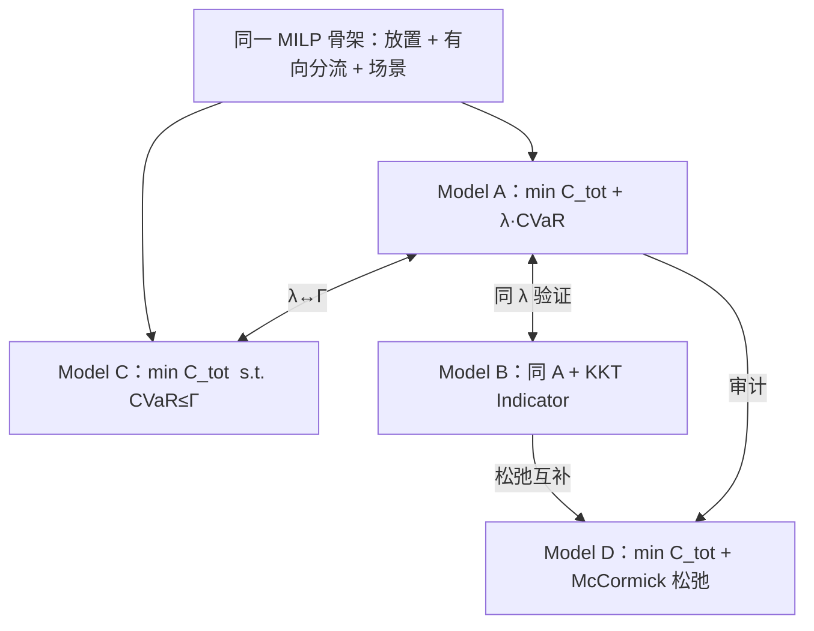

# 算力感知路由与风险约束联合优化：建模、求解框架与实验设计（论文初稿）

> **文档说明**：本文稿面向学位论文/期刊投稿的建模章节初稿，与仓库实现（`duibi.py`、`cvar_compare.py`、`b4_joint_data.py`、`teavar_framework_models.py`）对齐。  
> **符号与公式细节**另见 [`建模公式说明.md`](./建模公式说明.md)；**AEGIS 论文要点**见 [`AEGIS.md`](./AEGIS.md)。  
> **TEAVAR / Copo / AEGIS** 仅作思路启发，下文模型以**本研究的算力–网络联合场景**为准。

---

## 摘要（待润色）

在广域算力网络中，业务请求需经历「源节点 → 执行节点 → 目的节点」的有向两阶段传输，并消耗执行节点上 CPU、GPU、HBM 等多维算力。链路故障与算力容量波动会使送达率与运营成本同时恶化。本文在真实 B4 拓扑与扩展算力数据上，建立**任务放置、ingress/egress 多路径分流与 SLA 型条件风险价值（CVaR）**的混合整数线性规划（MILP）框架；以**总成本最小**为主经济目标，以**需求满足率尾部风险**为可解释约束。针对同一物理问题，给出四种**等价或近似**求解表述（Model A–D），阐明其逻辑关系、适用规模与联调顺序，并讨论与 TEAVAR、Copo、AEGIS 的差异及本文创新点。

**关键词**：算力网络；有向路由；任务放置；CVaR；ε-约束；联合优化

---

## 1 引言：问题从何而来

### 1.1 应用背景

云与算力网络运营商面临三类同时存在的决策：

1. **放哪里**：任务 \(i\) 部署在哪个算力节点 \(m\)（影响 CPU/GPU/HBM 占用与价格）；
2. **怎么走**：ingress 流量如何从入口送到 \(m\)，egress 流量如何从 \(m\) 送到目的（多路径、有向）；
3. **扛多大风险**：在链路中断、汇聚层算力骤降等场景下，是否仍能满足租户对**送达/吞吐**的要求，而不是仅在平时压低平均利用率。

早期自建玩具网络（少量节点、全连接、对称流量）难以反映 WAN 上**非均匀链路容量、异质故障率、分层算力角色**等特征。为此，本文在 **B4 拓扑**上引入 `node_compute_resources.csv`，并保持与 TEAVAR 实验兼容的 `demand.txt` 接口。

### 1.2 与三篇参考工作的关系（启发，非照搬）

| 工作 | 给我们的启发 | 本文**不**直接采用的部分 |
|------|----------------|---------------------------|
| **TEAVAR** (SIGCOMM’19) | 概率场景、隧道/路径分流、**需求未满足**的 VaR/CVaR 线性化 | 纯 WAN、无算力放置、无向两阶段业务流 |
| **Copo** (ICNP’25) | 放置成本 + 带宽成本联合；KKT/McCormick 将双层压单层 | 地理区域流、无 TEAVAR 式 SLA CVaR |
| **AEGIS** (TON’26) | Flow-based 可扩展性；**正常态吞吐下界 \(\gamma d\)**；**CVaR 作约束、成本作目标**（AEGIS-A） | 无向图、无多维算力、无「源→执行→目的」三跳语义 |

**本文定位**：在**有向图 + 路径预计算（K 短路）+ 多维算力放置**的前提下，用 **SLA 型 CVaR** 刻画尾部送达风险，用 **Model A/C** 作为**精确主求解链**；Physical 利用率 CVaR 与 Model B/D 分别作为**对照指标**与**Copo 式消融**。

---

## 2 预备知识：双层规划是否适用于本文？

### 2.1 双层规划在讲什么（结合公开教材/综述的常见表述）

**双层规划（Bilevel Programming）** 具有上下层递阶结构：

- **上层**决定策略变量 \(x\)（如成本相关决策）；
- **下层**在 \(x\) 给定后求解自身优化，得到 \(y^\*(x)\)；
- 上层目标与约束依赖 \(y^\*(x)\)。

典型形式：

\[
\min_{x\in X}\ F(x, y)\quad
\text{s.t.}\quad G(x,y)\le 0,\quad
y\in \arg\min_{y\in Y}\ \{ f(x,y): g(x,y)\le 0 \}.
\]

**适用场景**：领导者–跟随者（如网络设计 + 用户均衡）、定价 + 市场响应、**成本优化 + 性能/风险子问题** 等。求解上常将下层 **KKT 条件**写入上层，得到 **MPEC**；其中 **互补松弛** \(\lambda_i g_i(x,y)=0\) 非线性，常用 **大 M / Indicator / McCormick** 处理（与 Copo、本仓库 Model B/D 一致）。

### 2.2 本文问题中「像双层」的部分是什么？

自然分解为：

| 层级 | 决策 | 目标直觉 |
|------|------|----------|
| **上层（运营商）** | 放置 \(y_{im}\)、分流 \(x^{in}, x^{out}\) | **最小化** 放置费 + 带宽费 |
| **下层（风险评估）** | 给定调度后，在各场景 \(s\) 上评价 **损失** \(L_s\) | 关心 **尾部**：\(\mathrm{CVaR}_\beta(L)\) |

若严格写成双层，下层可以是「在给定 \(y,x\) 下，损失已确定；上层再选 \(y,x\) 使 CVaR 最小」——这与 **TEAVAR 将 CVaR 用 Rockafellar–Uryasev 辅助变量并入单层** 在数学上等价，**不必**为了「像论文」而强行保留互补变量。

### 2.3 本文为何**不将双层规划作为主模型叙述**？

1. **主问题已可单层 MILP 精确表达**：SLA CVaR 对离散场景 \(s\) 的线性化与 TEAVAR 同源（见第 5 节），Model A/C **全局最优**（在有限场景集上）。
2. **双层 + KKT + Indicator（Model B）** 仅增加二元变量，用于**验证** A 的线性化，**不带来新解**，大网更慢。
3. **双层 + McCormick（Model D）** 为 Copo 式**松弛**，实验显示 **CVaR 可严重偏离** Model A，**不能**作为「大数据主求解器」。
4. **AEGIS 的启示**在于「**min 成本，s.t. CVaR ≤ Γ**」与 **Γ 二分**，这对应本仓库 **Model C**，而非 Model D。

**结论（写入论文的立场）**：本文**以单层 MILP（Model A/C）为方法论主线**；双层/KKT/McCormick 仅作为**与 Copo 对话的求解论补充**（Model B/D），并在第 7 节说明联调顺序。

---

## 3 系统模型与符号表

### 3.1 问题背景（用一句话串起来）

给定**有向**物理拓扑、离散故障场景、任务集合与候选路径族，同时决定**任务放哪、ingress/egress 各走哪条路径**，使**期望意义下的运营总成本**尽可能低，且**需求未满足率的 CVaR** 不超过运营商给定的风险预算。

### 3.2 集合与索引

| 符号 | 含义 |
|------|------|
| \(\mathcal{I}\) | 任务集合，\(i\in\mathcal{I}\) |
| \(\mathcal{M}\) | 算力/交换节点，\(m\in\mathcal{M}\) |
| \(\mathcal{K}\) | 资源类型，如 \(k\in\{CPU,GPU,HBM\}\) |
| \(\mathcal{S}\) | 离散场景，\(s\in\mathcal{S}\)，概率 \(\pi_s\) |
| \(\mathcal{E}\) | **有向**链路 \((u,v)\)，容量 \(B_e\)，场景可用率 \(\sigma_{es}\in[0,1]\) |
| \(\mathcal{P}_{uv}\) | 预计算的 \(u\to v\) 候选简单路径集合（至多 \(K\) 条） |
| \(h\) | 物理 **hub**（放置、应力实验用）；流锚点可由 hub 或 UMCF 虚拟源/汇决定 |

### 3.3 参数（输入数据）

| 符号 | 含义 |
|------|------|
| \(b^{in}_i, b^{out}_i\) | 任务 \(i\) 的 ingress / egress 业务量 |
| \(w_{ik}\) | 任务 \(i\) 对资源 \(k\) 的需求 |
| \(\pi_{mk}\) | 节点 \(m\) 上资源 \(k\) 的单位价格 |
| \(C^{norm}_{mk}\) | 名义（\(s=0\) 设计）算力容量上界 |
| \(C^N_{mks}\) | 场景 \(s\) 下节点 \(m\) 资源 \(k\) 的可用容量 |
| \(\beta_{loss}\) | SLA CVaR 置信水平（代码 `beta_loss`） |
| \(\omega\) | 期望送达奖励权重（可选） |

### 3.4 决策变量

| 符号 | 类型 | 含义 |
|------|------|------|
| \(y_{im}\in\{0,1\}\) | 二元 | 任务 \(i\) 是否放置在 \(m\) |
| \(x^{in}_{i,m,p}\ge 0\) | 连续 | 任务在 \(m\) 上 ingress 走路径 \(p\) 的流量 |
| \(x^{out}_{i,m,q}\ge 0\) | 连续 | 任务在 \(m\) 上 egress 走路径 \(q\) 的流量 |
| \(d^{in}_{i,m,p,s}, d^{out}_{i,m,q,s}\ge 0\) | 连续 | 场景 \(s\) 下**实际送达**量（SLA 模型） |
| \(\zeta, u_s\ge 0\) | 连续 | SLA CVaR 的 Rockafellar–Uryasev 辅助变量 |

**流锚点**（实现：`teavar_flow_anchors(data)`）：

- 默认 hub 径向：ingress 在 \((h,m)\) 的 \(\mathcal{P}_{hm}\)，egress 在 \((m,h)\) 的 \(\mathcal{P}_{mh}\)；
- UMCF：\(s_{src}=V_s\)，\(s_{dst}=V_t\)，候选为单跳 \((V_s,m)\)、\((m,V_t)\) 等（见 `建模公式说明.md` §6.7）。

### 3.5 有向图说明（避免与 AEGIS 混淆）

- 数据与实现均为 **有向图**：`topology.txt` 每行一条弧；\(B_e,\sigma_{es}\) 绑定于 \((u,v)\)。
- 反向物理链路若存在，建模为**两条有向边**，而非一条无向边。

---

## 4 成本模型：运营商「总成本最小」

### 4.1 建模思路

运营商直接支付两类费用：**把任务放在哪**（按资源单价计费），以及**流量经过哪些路径**（代码中用路径 hop 数作带宽成本代理，与 `duibi` 一致）。

### 4.2 公式

**放置成本**：

\[
c_p = \sum_{i\in\mathcal{I}}\sum_{m\in\mathcal{M}} y_{im}\sum_{k\in\mathcal{K}} w_{ik}\,\pi_{mk}.
\]

**带宽成本**（\(|p|\) 为路径 hop 数）：

\[
c_b = \sum_{i,m,p} x^{in}_{i,m,p}\,|p| + \sum_{i,m,q} x^{out}_{i,m,q}\,|q|.
\]

**可选期望送达奖励**（鼓励提高 \(\mathbb{E}[\mathrm{Del}]\)，实现中为减号）：

\[
\mathbb{E}[\mathrm{Del}] = \sum_{s\in\mathcal{S}}\pi_s\Bigl(\sum_{i,m,p} d^{in}_{i,m,p,s} + \sum_{i,m,q} d^{out}_{i,m,q,s}\Bigr).
\]

**经济总成本**（主论文推荐写法）：

\[
C_{tot} = c_p + c_b - \omega\,\mathbb{E}[\mathrm{Del}].
\]

### 4.3 物理约束（与成本并列，非「第二层目标」）

\[
\sum_{m\in\mathcal{M}} y_{im} = 1,\quad \forall i;
\]

\[
\sum_{p} x^{in}_{i,m,p} = y_{im}\, b^{in}_i,\quad
\sum_{q} x^{out}_{i,m,q} = y_{im}\, b^{out}_i,\quad \forall i,m;
\]

\[
\sum_{i} w_{ik}\, y_{im} \le C^{norm}_{mk},\quad \forall m,k.
\]

链路容量与场景耦合在 SLA 送达变量 \(d\) 与流量聚合约束中实现（见下节）。

---

## 5 风险模型：SLA 型 CVaR（主风险度量）

### 5.1 为何采用「送达/满足率」而非「利用率 CVaR」？

| 度量 | 回答的问题 | 本文角色 |
|------|------------|----------|
| **SLA：需求未满足比例** | 故障时用户业务断了多少？ | **主风险**，对齐 TEAVAR/AEGIS 用户视角 |
| **Physical：算力/链路利用率** | 资源是否拥塞/超载？ | **对照/报告指标**，或 \(s=0\) 硬容量上界 |

算力网络中「包送到但算力不够」仍可能失败，故在 SLA 模型上可叠加 **算力未满足 CVaR** \(\mathrm{CVaR}^{sf}\)（可选，见 `lambda_compute_sf`）。

### 5.2 场景损失与送达耦合（建模思路）

对每个场景 \(s\)：

1. 仅当路径 \(p\) 上所有边 \(\sigma_{es}>0\) 时，ingress 送达 \(d^{in}_{i,m,p,s}\) 才可沿该路径传递；
2. 聚合 ingress/egress 得到 \(R^{in}_{is}, R^{out}_{is}\)；
3. 定义相对 **未满足比例**（与 TEAVAR 的 \(1-R/d\) 同构）。

### 5.3 公式（SLA CVaR）

\[
u_s\, b^{in}_i \ge b^{in}_i - R^{in}_{is} - b^{in}_i\,\zeta,\quad
u_s\, b^{out}_i \ge b^{out}_i - R^{out}_{is} - b^{out}_i\,\zeta,\quad
\forall s,i.
\]

\[
\mathrm{CVaR}^{SLA} = \zeta + \frac{1}{1-\beta_{loss}}\sum_{s\in\mathcal{S}} \pi_s\, u_s.
\]

**公式含义**：

- \(\zeta\)：VaR 阈值，可理解为「损失可接受的分位点」；
- \(u_s\)：场景 \(s\) 上损失超过 \(\zeta\) 部分的超额；
- 加权平均即 **尾部条件期望**，对应运营商「最坏 \((1-\beta)\) 概率质量里的平均损失」。

### 5.4 借鉴 AEGIS：正常态吞吐下界（建议作为扩展约束）

AEGIS 在正常态强制 \(f_k \ge \gamma d_k\)。对应本文可在 **\(s=0\)** 增加：

\[
\frac{R^{in}_{i,0}}{b^{in}_i} \ge \gamma,\quad
\frac{R^{out}_{i,0}}{b^{out}_i} \ge \gamma,
\]

表示**无故障场景下**至少保证比例 \(\gamma\) 的送达。该约束与 CVaR **正交**：CVaR 管尾部，\(\gamma\) 管「平时底线」。

---

## 6 路径预计算（与 TEAVAR 一致、与 AEGIS 不同）

### 6.1 思路

在 **有向图** 上对每对 \((u,v)\) 用 Yen/K 短路思想（实现：`networkx.shortest_simple_paths`）预计算至多 \(K\) 条简单路径，存入 \(\mathcal{P}_{uv}\)。优化阶段**不再选路**，只在候选路径上分 flow。

### 6.2 利弊（诚实写入论文）

| 优点 | 缺点 |
|------|------|
| 与 TEAVAR 实验链兼容；MILP 结构清晰 | 大网上 \(|\mathcal{P}|\) 膨胀（AEGIS 批评点） |
| 便于 hub/UMCF 锚点语义 | 限制「路径集合外」的绕路 |

**扩展方向**（未来工作）：AEGIS 式 **弧上多商品流**，替代 `P_cand` 枚举。

---

## 7 四种求解模型（Model A–D）：逻辑关系与联调

> **统一说明**：四套模型共享 **第 3–5 节的同一套物理约束与 SLA CVaR 定义**（或 Physical CVaR 对照版）；差别仅在 **目标函数写法** 与 **是否引入 KKT/McCormick**。

### 7.1 总览：按「保真度」而非「速度」排序

### 7.2 Model A — 单层加权（主求解器 · 精确）

**提出原因**：将成本与 SLA 尾部风险放在**同一层**优化，用 TEAVAR 成熟的 RV 线性化，得到**标准 MILP**，便于 λ 扫描、画 cost–risk Pareto 前沿。

**数学形式**：

\[
\min\ C_{tot} + \lambda_{sla}\,\mathrm{CVaR}^{SLA} + \lambda_{sf}\,\mathrm{CVaR}^{sf}.
\]

（\(\lambda_{sf}=0\) 时不建算力未满足块。）

| 优点 | 缺点 |
|------|------|
| 精确、实现简单（`build_teavar_sla_cvar_model`） | λ 的业务含义需向 Γ 翻译 |
| 小中规模通常最快 | 多 λ 点需多次求解 |

**代码**：`teavar_framework_models.build_teavar_model_a` → `cvar_compare.build_teavar_sla_cvar_model`。

---

### 7.3 Model C — ε 约束 / 风险预算（主求解器 · 精确 · 对齐 AEGIS-A 思想）

**提出原因**：运营商更易理解「**CVaR 不得超过 Γ**」，而非「λ 等于多少」。与 Model A 描述**同一条 Pareto 前沿**；形式为 **min 成本**，适合作为**大规模默认**（固定 Γ 或二分 Γ）。

**数学形式**：

\[
\min\ C_{tot}\quad
\text{s.t.}\quad \mathrm{CVaR}^{SLA} \le \Gamma_{sla},\quad
\mathrm{CVaR}^{sf} \le \Gamma_{sf}\ \text{(可选)}.
\]

| 优点 | 缺点 |
|------|------|
| 风险预算可解释；便于准入控制 | Γ 过紧 → 不可行（可探测边界） |
| Γ 由 Model A 标定：\(\Gamma \approx 1.05\times \mathrm{CVaR}^*\) | 每个 Γ 需求解一次 |

**代码**：`build_teavar_model_c`；Physical 版 `build_epsilon_constraint_model`（利用率 CVaR，对照用）。

**与 AEGIS 的衔接**：AEGIS-A 将 CVaR 作约束、资源作目标；本文 **C** 将 **成本** 作目标、**SLA CVaR** 作约束——结构同构，**目标物不同**（本文是算力网账单，AEGIS 是弧流量和）。

---

### 7.4 Model B — KKT + Indicator（验证件 · 精确 · 可选）

**提出原因**：说明 Model A 的 CVaR 线性化**等价于**「下层风险极值 + KKT」的严格单层化，与 **Copo** 的 KKT 路线对话。

**数学形式**：与 A **相同目标**，额外加入 SLA（及可选 sf）CVaR 子问题的 **互补松弛 Indicator**。

| 优点 | 缺点 |
|------|------|
| 与 A 同 λ 下应 **cost/CVaR 一致**（验证） | **大量二元变量**，大网慢 |
| 论文可写「双层必要条件的严格实现」 | **非日常求解器** |

**建议**：论文**附录**或**一组小实例**跑 B，正文主链 **不写 B 为第四套并列方法**。

**代码**：`build_teavar_model_b`、`build_kkt_model`（Physical）。

---

### 7.5 Model D — McCormick 松弛（消融 · 近似 · 不推荐作主结果）

**提出原因**：复现 **Copo** 用 McCormick 替代 Indicator 以降低难度的思路，用实验展示 **「快但不准」的风险穿透**。

**数学形式**：\(\min C_{tot}\)，对 KKT 互补用 \(\frac{\alpha}{\alpha_{max}}+\frac{slack}{slack_{max}}\le 1\) 类包络松弛。

| 优点 | 缺点 |
|------|------|
| 有时单次求解变量结构更「松」 | **事后 CVaR 可远大于 A**（玩具/B4 均已观测） |
| 适合写 Copo 对比小节 | **不能**作为「大数据唯一求解器」 |

**若需加速**：推荐 **D 仅作 MIPStart → 再解 C**，报告以 **C 的 CVaR** 为准；而非只跑 D。

**代码**：`build_teavar_model_d`、`build_copo_mccormick_model`。

---

### 7.6 联调流程（实验与论文共用）

| 阶段 | 模型 | 输入 | 输出用途 |
|------|------|------|----------|
| 1 | **A** | λ 列表 | Pareto 点；\(\mathrm{CVaR}^*\) |
| 2 | **C** | \(\Gamma\) 由 A 标定 | **主结果**：min cost @ 风险预算 |
| 3（可选） | **B** | 同 λ | gap(A,B)≈0 验证 |
| 4（可选） | **D** | — | 消融：松弛 vs 精确 |

**命令行**：`python duibi.py --progressive --lambda 5`（当前管线含 B/D，建议改为 `--ac-only` 仅 A→C，见第 9 节）。

**大数据策略**：**不默认 D**；用 **C + 减任务/减 K/场景剪枝 + warm-start**；远期考虑 AEGIS 式 flow-based。

---

## 8 Physical CVaR 对照（从主模型退居附录）

**定义简述**：

\[
\mathrm{CVaR}^N:\ u_s \ge \frac{\sum_i w_{ik}y_{im}}{C^N_{mks}}-\zeta_N;\quad
\mathrm{CVaR}^L:\ v_s \ge \frac{\mathrm{flow}_e}{B_e\sigma_{es}}-\zeta_L.
\]

**用途**：

- 与 SLA 对比「保硬件 vs 保任务」（见 `Compute-aware Routing.md` 实验表）；
- **不**再作为本文主声称的「租户 SLA 保障」指标。

---

## 9 实现映射与文档索引

| 论文概念 | 代码入口 |
|----------|----------|
| B4 联合数据 | `b4_joint_data.load_b4_joint_data` |
| SLA Model A | `cvar_compare.build_teavar_sla_cvar_model` |
| SLA Model C/B/D | `teavar_framework_models.build_teavar_model_*` |
| Physical Model A/C | `duibi.build_single_layer_model`, `build_epsilon_constraint_model` |
| 递进管线 | `progressive_pipeline.run_physical_pipeline` / `run_teavar_sla_pipeline` |
| 论文 TEAVAR 复现 | `main.py --mode teavar` |

---

## 10 本文创新点（相对三篇参考）

1. **算力–网络联合**：多维 \(w_{ik}\)、\(C_{mks}\)、\(\pi_{mk}\) 与有向 ingress/egress 同一 MILP。  
2. **业务语义**：源 → 执行 → 目的，而非 TEAVAR 单 OD flow。  
3. **风险主线**：SLA 型 CVaR + 可选算力未满足 CVaR；与 Physical 利用率 CVaR 的系统对照。  
4. **工程机制**：hub 径向、应力场景、UMCF / 虚拟接入瓶颈，缓解 SLA CVaR 退化。  
5. **求解论**：A/C 精确主链 + B/D 作为 Copo/双层对话的验证与消融（**非四套并列主方法**）。  
6. **数据**：B4 异质容量、分层算力角色、独立 `prob_failure`（文档化；TEAVAR 复现仍可用 Weibull 场景）。

**未来工作**：AEGIS 式 flow-based；\(s=0\) 的 \(\gamma\) 硬约束；Γ 二分；场景聚类。

---

## 11 实验章节（保留现有结果，待并入正文）

玩具网与 B4 上 Physical vs SLA、UMCF 开闭、Model A–D 对比表见 [`Compute-aware Routing.md`](./Compute-aware Routing.md) 第 Evaluation 节。写作时建议：

- **主表**：SLA 的 Model A（λ 扫描）+ Model C（Γ 边界）；  
- **附录表**：Physical 对照、Model B 验证 gap、Model D 风险穿透。

---

## 参考文献（占位）

1. Bogle et al., *TeaVaR: Striking the Right Utilization-Availability Balance in WAN Traffic Engineering*, SIGCOMM 2019.  
2. Wang et al., *Copo: Joint Cost and Performance Optimization for Task Placement in Geo-Distributed Clouds*, ICNP 2025.  
3. Zhang et al., *AEGIS: Throughput-Guaranteed Resilient Routing via a Conditional Value-at-Risk Approach*, IEEE/ACM TON 2026.  
4. Rockafellar & Uryasev, CVaR optimization.  
5. 双层规划综述：城市交通领域双层规划研究与应用，2023.

---

*初稿版本：与仓库 `TEAVAR_python` 同步；后续修改模型时请同时更新 `建模公式说明.md` 与本文第 3–7 节。*
