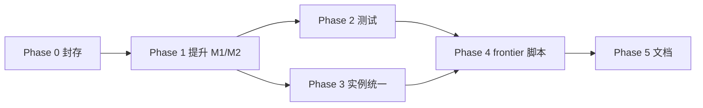

# M0→M2 主线合并实施计划

> **目的**：在**不破坏 P0 主链**的前提下，把已分散的设计/代码收拢为一条可跑、可测、可写论文的主线，满足五项产品要求。  
> **依据**：`docs/m0_m1_m2_建模说明.md`（v2）、现有 `m0_*.py`、`refactor/m1_models.py`、`refactor/m2_cost_models.py`、`toy_two_task_independent_data.py`。  
> **原则**：先合并、再替换；旧 Model A/C / 单路径 toy 只降级为对照，不一次性删除。

---

## 1. 五项要求的验收标准

| # | 要求 | 验收标准（Definition of Done） |
|:--|:--|:--|
| **R1** | 端到端 CVaR | 主模型随机损失为 $L_s^{E2E}=\sum_i\omega_i(1-z_{i,s})$（含 $\theta,D$ 可配置）；$\mathrm{CVaR}_\alpha(L^{E2E})$ 线性化；**无**并列 SLA+SF 双 CVaR 作为主 Formulation |
| **R2** | 玩具多路径 | 主实验 toy 每个 `(s_i,m)`、`(m,d_i)` **≥2** 条候选路径；单元测试断言路径数 |
| **R3** | 成本主目标 | 主模型目标为 $\min c_p + \mathbb{E}_s[c_b(x_s)]$（或 M2-Lex 第三层）；M0 负载目标仅作子阶段/对照 |
| **R4** | CVaR 与链路、算力相关 | 链路故障（$B_{e,s}$）与算力故障（$C_{m,s}$）均为 M1 **硬约束**；二者通过 $r_{i,m,s}\downarrow \to z\downarrow \to L^{E2E}\uparrow$ 进入**同一** CVaR，而非 duibi 式 link-util / node-util 双 CVaR |
| **R5** | 容量限制 | M0：名义 $B_e,C_m$ + $U^{max}\le 1$；M1/M2：场景 $\mathrm{LinkLoad}_{e,s}\le B_{e,s}$、$\sum r w\le C_{m,s}$ |

---

## 2. 现状快照（2025-06）

```text
已完成                          部分完成                         未合并/未改
─────────────────────────────────────────────────────────────────────────────
docs/m0_m1_m2 v2                refactor/m1_models.py            P0 run_gamma_frontier
m0_models.py + tests            refactor/m2_cost_models.py       teavar_framework Model A/C
m0_instances (multipath)        toy_two_task_independent (2-path)  toy_instances (_one_path)
                                tests/test_m2_cost_models.py     duibi util CVaR（旧对照）
```

**核心问题**：能力已在 `refactor/` 和 `toy_two_task_*` 里，但**没有成为仓库默认入口**；根目录 M0 与 M2 成本目标尚未串成一条命令可复现的 pipeline。

---

## 3. 目标架构（合并后）

```text
instances/          数据层（多路径 + 场景 + 定价）
    m0_instances.py           ← 保留 M0 小 toy
    toy_two_task_*.py         ← M1/M2 主 toy（已有多路径）

models/             模型层（分层构建）
    m0_models.py              ← 确定性基线（U^max，无 CVaR）
    m1_models.py              ← 从 refactor 提升
    m2_cost_helpers.py
    m2_cost_models.py         ← M2-C-Cost / M2-Lex-3（主推）
    m2_c_cost_models.py       ← adaptive 场景剪枝版（可选）

scripts/            实验入口（新 frontier，不动 P0）
    run_m2_gamma_frontier.py
    run_m0_baseline_scan.py

tests/              分层测试
    test_m0_model.py
    test_m1_model.py          ← 新建
    test_m2_cost_models.py    ← 已有，改 import 路径

legacy/ 或标记 deprecated
    toy_instances.py 单路径 toy → 仅 exact_validation 对照
    teavar_framework_models → P0 冻结
```

**说明**：第一版可**不物理搬目录**，仅把 `refactor/m1_models.py` 等**复制/ symlink 到根目录**并统一 import；待稳定后再整理目录。

---

## 4. 分阶段计划

### Phase 0 — 基线封存（0.5 天）

**目标**：固定当前可复现 commit，避免合并时丢代码。

| 动作 | 产出 |
|:--|:--|
| git 提交当前 `m0_*`、`docs/m0_m1_m2*`、`tests/test_m0_*` | baseline commit |
| 记录 `refactor/` 与根目录重复文件清单 | `docs/m0_m2_integration_plan.md` 附录 A |
| 确认 `tests/test_m2_cost_models.py` 在本地 green | 测试日志 |

**退出条件**：`python -m unittest tests.test_m0_model` 与 `pytest tests/test_m2_cost_models.py` 均通过。

---

### Phase 1 — 模型层提升到根目录（1–2 天）

**目标**：根目录可直接 `from m1_models import ...`，不再依赖 `refactor.` 前缀。

| 任务 | 文件 | 说明 |
|:--|:--|:--|
| 1.1 提升 M1 | `m1_models.py` ← `refactor/m1_models.py` | 改 import：`from m0_models import ...` |
| 1.2 提升 helpers | `m2_cost_helpers.py` | E2E loss + CVaR RU + 成本表达式 |
| 1.3 提升 M2-C | `m2_cost_models.py` | `build_m2_c_cost_model`, `solve_m2_lex3` |
| 1.4 可选 adaptive | `m2_c_cost_models.py` | 场景剪枝；与 smoke 脚本对齐 |
| 1.5 统一符号 | 全模块 | `beta_cvar`/`alpha`、`gamma`、`rho_compute`/`rho_link` 与文档一致 |

**退出条件**：

- [ ] `build_m1_model(toy)` 可行且 $z_{i,s_0}=1$ 约束可满足  
- [ ] `build_m2_c_cost_model(toy, gamma)` 目标为 $c_p+\mathbb{E}[c_b]$  
- [ ] 无 `S,r,z` 出现在 `m0_models`；M2 含 $\eta,u_s\in[0,1]$

---

### Phase 2 — 测试与 import 统一（1 天）

**目标**：测试只指向根目录模块；覆盖 R1–R5。

| 新建/修改 | 断言内容 |
|:--|:--|
| `tests/test_m1_model.py` | recourse 变量存在；场景链路/算力硬约束；$0\le r\le y$；$z=\sum r$ |
| 改 `tests/test_m2_cost_models.py` | `from m2_cost_models import ...`；γ 单调；正常场景 $z=1$ |
| 改 `tests/test_m2_c_cost_adaptive.py` | adaptive builder import 路径 |
| 扩 `tests/test_m0_model.py` | 与 M1 共用 `build_m0_toy` 或明确两个 toy 分工 |

**R2 专项测试**（可放在 `test_m1_model` 或 toy 测试）：

```python
for i, m: assert len(P_cand[src,m]) >= 2
for i, m: assert len(P_cand[m,dst]) >= 2
```

**R4 专项测试**：

- 构造「仅链路坏」场景：$z<1$，$L^{E2E}>0$  
- 构造「仅算力坏」场景：同上  
- 断言 CVaR 随 $L^{E2E}$ 上升（post-hoc 或模型内 $\eta,u$）

**退出条件**：`unittest` + `pytest` 新增用例全绿；CI 可只跑 `tests/test_m0_*` + `tests/test_m1_*` + `tests/test_m2_*`。

---

### Phase 3 — 实例层统一（1 天）

**目标**：论文/实验默认只用多路径 toy；旧 toy 降级。

| 任务 | 说明 |
|:--|:--|
| 3.1 主 toy 定稿 | **`toy_two_task_independent_data.build_toy_2task_independent_v1`** 为 M1/M2 默认 |
| 3.2 M0 toy | **`m0_instances.build_m0_toy`** 仅用于 M0 λ 扫描与 M1 结构对照 |
| 3.3 旧 toy 标记 | `toy_instances.py` 文件头注明 **legacy / single-path**；`exact_validation` 测试保留但不进主 frontier |
| 3.4 可选 | 给 `toy_instances` 加 `_two_paths` 变体 `build_toy_sla_multipath()`（低优先级） |

**退出条件**：主 smoke 脚本只引用 `toy_two_task_*` + `m0_instances`；文档表「主实验实例」更新。

---

### Phase 4 — 实验脚本与新 frontier（1–2 天）

**目标**：一条命令跑通 **成本–CVaR frontier**，与 P0 并行。

| 脚本 | 功能 |
|:--|:--|
| `scripts/run_m0_baseline_scan.py` | 扫 `lambda_m0`，输出 $(U_link,U_node)$ |
| `scripts/run_m2_gamma_frontier.py` | 扫 `gamma`，固定 `alpha`；输出 CSV：`cost_p,cost_b,cvar,L_s_mean,placement` |
| `scripts/run_m2_lex_smoke.py` | M2-Lex-3 三 pass 词典序 smoke |

**输出约定**（与旧 P0 CSV 列名区分）：

```text
model=m2_c_cost, alpha, gamma, cost_deploy, cost_bw, cvar_e2e, u_link_nominal, u_node_nominal
```

**退出条件**：

- [ ] frontier CSV 可画图（γ 紧 → 成本升或 CVaR 降）  
- [ ] **不修改** `run_gamma_frontier.py` 默认行为

---

### Phase 5 — 文档与论文对齐（0.5–1 天）

| 文档 | 更新 |
|:--|:--|
| `docs/m0_m1_m2_建模说明.md` | 增加「实现状态」表：M0/M1/M2 对应文件与入口 |
| `README` 或 `results/README_metrics.md` | 主实验命令、主 toy 名称、与 P0 关系 |
| 论文 Formulation | 主文：**M2-C-Cost** + E2E CVaR；M0 放 baseline；Model A/C 放 appendix |

**退出条件**：新同学仅读文档 + 跑两个脚本即可复现主图。

---

### Phase 6 — 可选后续（不在本轮必须）

| 项 | 说明 |
|:--|:--|
| B4 缩放 | `b4_joint_data` + 多路径 k≥2 接入 M2-C |
| 精确枚举对照 | 扩展 `exact_enumeration_solver` 到 $L^{E2E}$ 损失 |
| L2-full | 与 `l2_full_models.py` 并行，不阻塞主线 |
| 退役 P0 | 主图稳定后再讨论切换 `run_gamma_frontier` |

---

## 5. 依赖关系（实施顺序）



**关键路径**：Phase 1 → Phase 2 → Phase 4（M2-C-Cost 可跑 frontier）。

---

## 6. 风险与对策

| 风险 | 对策 |
|:--|:--|
| `refactor/` 与根目录 `m0_models` 漂移 | Phase 1 以根目录为准，删或归档 `refactor/m0_*` 副本 |
| import 循环（m1→m0→duibi_metrics） | helpers 保持纯函数；data 用 dataclass，不引 Gurobi |
| 场景数爆炸（512） | 主实验用 `toy_two_task` pruned + `aggregate_worst`；全场景放 appendix |
| γ frontier 不可行 | 先求 $\gamma_{\min}$（M2-Lex pass-1）；脚本自动 bracket |
| 与「CVaR 要 link+node 两项」理解冲突 | 论文写清：**统一 E2E CVaR**；duibi 双 util CVaR 仅 appendix 对照 |

---

## 7. 里程碑检查表（给 agent / 自己用）

```text
[ ] M1 在根目录 import 无 refactor 前缀
[ ] M2-C 目标 = c_p + E[c_b]，约束 CVaR_E2E ≤ γ
[ ] 主 toy 全 OD ≥2 paths（自动化测试）
[ ] 链路-only / 算力-only 故障均使 L^E2E > 0
[ ] M0 U_link, U_node ∈ [0,1] 硬容量
[ ] run_m2_gamma_frontier.py 产出 CSV
[ ] P0 run_gamma_frontier 未改默认
[ ] docs 实现状态表已更新
```

---

## 8. 建议的第一条实施命令（Phase 1 启动）

```bash
# 1. 复制提升（示例）
cp refactor/m1_models.py m1_models.py
cp refactor/m2_cost_helpers.py m2_cost_helpers.py
cp refactor/m2_cost_models.py m2_cost_models.py

# 2. 批量改 import（m1_models 内 refactor.m0_models → m0_models）

# 3. 跑测试
python -m unittest tests.test_m0_model -v
pytest tests/test_m2_cost_models.py -v
```

---

## 附录 A — 文件对照

| 能力 | 当前最佳实现 | 合并后位置 |
|:--|:--|:--|
| M0 硬容量 + 多路径 | `m0_models.py`, `m0_instances.py` | 保持 |
| M1 recourse | `refactor/m1_models.py` | `m1_models.py` |
| M2 E2E CVaR + 成本 | `refactor/m2_cost_models.py` | `m2_cost_models.py` |
| M2 adaptive 场景 | `refactor/m2_c_cost_models.py` | `m2_c_cost_models.py` |
| 主 toy | `toy_two_task_independent_data.py` | 保持 |
| 旧单路径 toy | `toy_instances.py` | legacy |
| P0 Model A/C | `teavar_framework_models.py` | 冻结 |

---

**预计总工时**：约 **5–7 人天**（含联调与文档）；若只做 Phase 0–2，约 **3 人天** 即可得到「根目录 M0+M1+M2-C 可测」。
